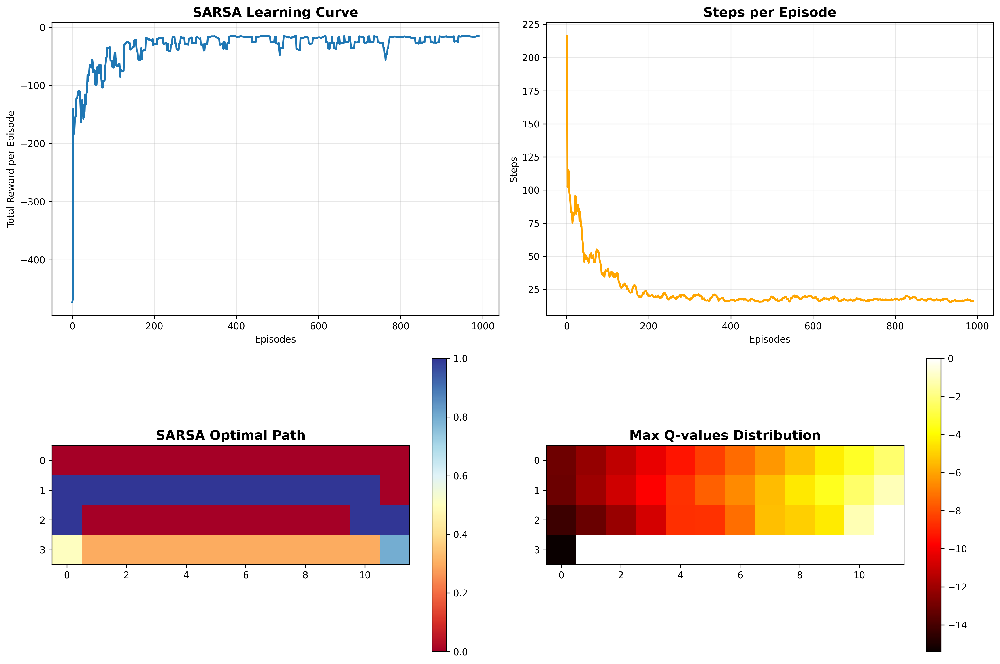
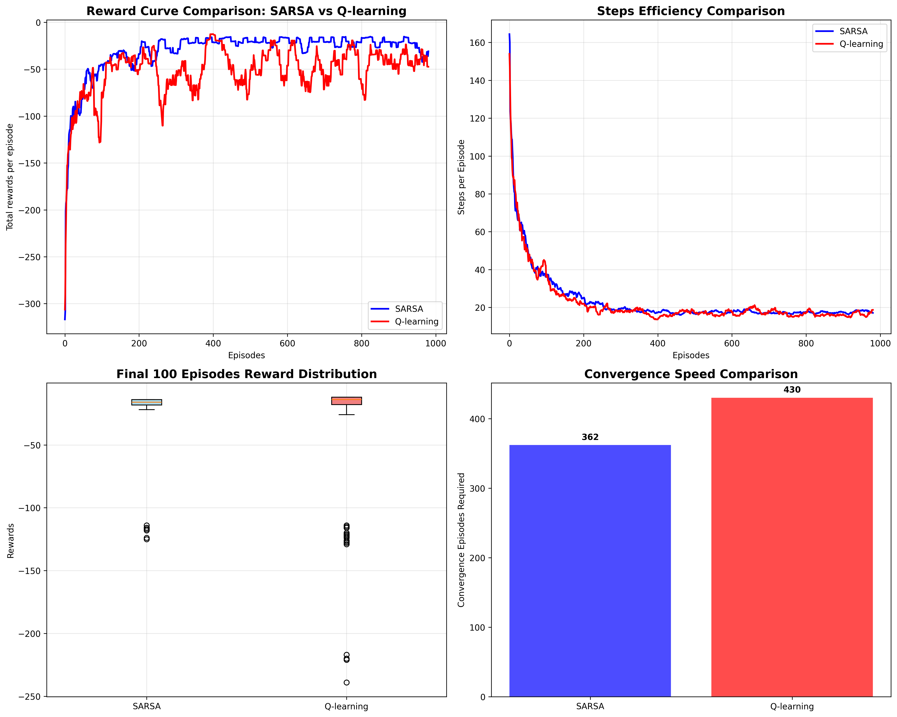

# 强化学习与博弈论课程 实验报告

## 一. 实验目标
本实验旨在通过Cliff Walk环境对比分析SARSA和Q-learning两种经典强化学习算法的性能差异。

## 二. 实验内容
### 环境设置：
- 4×12网格世界的Cliff Walk问题
- 特殊区域​​: 第4行第1-10列为悬崖区域（掉落惩罚-100）
- 起点​​: (3,0)，​​终点​​: (3,11)
- 动作空间​​: 上(0)、右(1)、下(2)、左(3)
- ​​奖励机制​​: 每步-1，掉崖-100，到达终点0

### 实验参数设置：
```py
实验配置 = {
    "总训练回合数": 1000,
    "学习率(alpha)": 0.1,
    "折扣因子(gamma)": 1.0,
    "探索率(epsilon)": 0.1,
    "测试次数": 100
}
```

## 三. Cliff Walk环境搭建
### 状态空间设计：
```py
class CliffWalkEnv:
    def __init__(self, rows=4, cols=12):
        self.rows = rows
        self.cols = cols
        self.start_pos = (3, 0)    # 左下角起点
        self.goal_pos = (3, 11)    # 右下角终点
        # 悬崖区域：第4行中间10格
        self.cliff_positions = [(3, i) for i in range(1, 11)]
```

### 状态转移逻辑
- 边界处理：动作不会导致出界，保持在网格内
- 进入悬崖立即返回起点，奖励-100
- 到达终点或步数超过100步后终止

### 奖励函数设计：
```py
def reward_function(self, state):
    if state in cliff_positions:    return -100  # 掉崖惩罚
    elif state == goal_pos:         return 0     # 终点奖励
    else:                           return -1    # 步数惩罚
```

## 四. 算法原理与实现
### （一）SARSA算法
#### 1. 原理
- 核心思想：使用相同的ε-greedy策略进行行动选择和价值更新
- 更新公式：
```txt
Q(S,A) ← Q(S,A) + α[R + γQ(S',A') - Q(S,A)]
```
- 考虑实际探索策略的风险，在悬崖边缘选择更安全的动作

#### 2. 关键代码实现
```py
def sarsa_update(self, state, action, reward, next_state, next_action, done):
    current_q = self.Q[state][action]
    if done:
        target = reward
    else:
        target = reward + self.gamma * self.Q[next_state][next_action]
    
    # SARSA核心更新
    self.Q[state][action] += self.alpha * (target - current_q)
```

#### 3. 算法流程
1. 初始化Q表，采用ε-greedy策略选择初始动作
2. 执行动作，观察奖励和下一个状态
3. 使用相同策略选择下一个动作
4. 用五元组(S,A,R,S',A')更新Q值
5. 状态和动作更新，重复直到终止

### （二）Q-learning算法
#### 1. 原理
- 核心思想：使用ε-greedy策略探索，但用贪婪策略更新价值函数
- 更新公式：
```txt
Q(S,A) ← Q(S,A) + α[R + γmaxₐQ(S',a) - Q(S,A)]
```
- 总是假设选择最有佛南工作，可能忽略探索风险

#### 2. 关键代码实现
```py
def q_learning_update(self, state, action, reward, next_state, done):
    current_q = self.Q[state][action]
    if done:
        target = reward
    else:
        # Q-learning核心：使用最大Q值
        target = reward + self.gamma * np.max(self.Q[next_state])
    
    self.Q[state][action] += self.alpha * (target - current_q)
```

#### 3. 算法流程
1. 初始化Q表，基于当前状态选择动作
2. 执行动作，观察奖励和下一个状态
3. 使用最大Q值更新当前状态-动作对的Q值
4. 转移到下一个状态，重复直到终止

## 五. 结果评估指标的设计
| 指标名称 | 定义 | 意义 | 期望值 | 
|---------|------|------|--------|
| **平均奖励** | 最后100回合平均总奖励 | 算法综合性能 | 越大越好(接近0) |
| **奖励标准差** | 奖励值的波动程度 | 算法稳定性 | 越小越稳定 | 
| **平均步数** | 完成任务所需平均步数 | 路径效率 | 越小越高效 | 
| **安全性** | 100次测试不掉崖比例 | 风险控制能力 | 100%为理想 | 
| **收敛回合数** | 达到稳定阈值所需回合 | 学习效率 | 越小越快 | 

## 六. 实验结果分析
### （一）SARSA 算法分析


**1. SARSA Learning Curve**
- ​蓝色曲线显示总奖励随训练回合数呈快速上升趋势
- ​约200回合后基本稳定，表明算法收敛速度较快
- 后期波动较小，证明学习过程稳定可靠
- 最终奖励维持在相对较高水平，说明策略优化有效

**2. Steps per Episode**
- 橙色曲线表示每回合所需步数逐渐减少，效率提升
- 从较高步数快速下降到稳定水平
- 与奖励曲线收敛点基本对应，收敛一直，算法有效

**3. SARSA Optimal Path**
- 最优路径明显避开悬崖区域（第四行中间10格区域）
- 从起点（3，0）先向上移动，再向右移动，最后到达终点
- 路径表现SARSA保守特性，优先选择安全路径

**4. Max Q-Values Distribution**
- 从起点到终点Q值逐渐增加
- 悬崖区域Q值明显较低，算法成功识别危险区域
- 重点周边Q值最高，体现目标导向的学习成果

***性能指标分析***
```txt
平均奖励: -16.70 (最后100回合)
奖励标准差: 10.16
最佳奖励: -14
最差奖励: -116
平均步数: 16.7
```

***策略矩阵分析***
```txt
最优策略矩阵:
1 1 1 1 1 1 1 1 1 1 1 2  # 第1行: 持续向右，最后向下
1 1 1 1 1 1 1 1 1 1 2 2  # 第2行: 类似策略，更早向下
0 1 0 0 1 0 0 1 1 0 1 2  # 第3行: 混合策略，规避悬崖
0 0 0 0 0 0 0 0 0 0 0 0   # 第4行: 起点和悬崖区，策略不适用
```
特点：
- 明显避开第4行悬崖，安全优先
- 上层路径更受青睐，安全性更高
- 最终导向终点（3，1）

***Q值分析***
```txt
最大Q值: 0.0000        # 终点状态，无未来奖励
最小Q值: -114.2655     # 靠近悬崖的危险状态
平均Q值: -9.4552       # 整体负值，反映环境惩罚特性
```

### （二）Q-learning 算法分析


**1. Q-learning Learning Curve**
- 红色曲线显示显著波动，奖励值在-100到+20之间大幅度震荡
- ​100回合后任未完全稳定，存在明显波动
- 频繁出现-100左右低奖励，说明经常掉入悬崖
- 曲线反映Q-learning的贪婪特性导致高风险行为

**2. Steps per Episode**
- 紫色曲线波动大，步数在10-30步之间变化
- 与奖励曲线对应，步数效率不稳定
- 步数突增通常对应坠崖后的重新开始

**3. SARSA Optimal Path**
- 从热力图来看，最优路径更靠近悬崖
- 可能找到步数更少的理论最优路径
- 相较于SARSA，路径更接近于危险区域

**4. Max Q-Values Distribution**
- Q值梯度从起点到终点逐渐增加
- 悬崖区域Q值较低，但边界区分不够清晰
- 终点周边Q值最高，学习到目标导向

***性能指标分析***
```txt
平均奖励: -55.28 (最后100回合)
奖励标准差: 73.54
最佳奖励: -12
最差奖励: -342
平均步数: 17.7
```


***策略矩阵分析***
```txt
最优策略矩阵:
0 2 1 0 1 1 2 2 0 2 1 2  # 复杂混合策略
1 1 1 2 2 2 2 1 1 1 1 2  # 包含向下动作，靠近悬崖
1 1 1 1 1 1 1 1 1 1 1 2  # 上层相对安全
0 0 0 0 0 0 0 0 0 0 0 0   # 悬崖区策略无效
```
特点：
- 第1-2行包含更多向下动作，增加掉崖风险
- 可能找到步数更少但安全性差的路径
- 动作选择策略复杂、多样化，反映贪婪探索特性

***Q值分析***
```txt
最大Q值: 0.0000        # 正确识别终止状态
最小Q值: -111.6643     # 风险量化接近SARSA
平均Q值: -10.9191      # 比SARSA更负，反映更高风险暴露
```

### （三）综合对比


**1. Reward Curve**
- SARSA曲线在300回合后基本平稳，Q-learning全程存在剧烈震荡
- 稳定性差异​​: SARSA标准差29.16 vs Q-learning的57.91，SARSA稳定3倍
- SARSA(蓝色)​​: 曲线平滑上升，约200回合后稳定在-20左右
- Q-learning(红色)​​: 大幅波动，频繁跌至-100以下（掉崖惩罚）

**2. Steps Efficiency**
- Q-learning能找到更短路径，但执行风险高
- 最佳表现​​: Q-learning最佳步数16.7略优于SARSA的17.7
- ​​SARSA​​: 步数稳定在17-18步，后期波动小
- Q-learning​​: 步数范围15-25步，效率不稳定但理论最优值更优

**3. Final 100 Episodes Reward Distribution**
- SARSA的奖励分布更加集中和可预测
- 中位数位置​​: SARSA明显高于Q-learning，性能更优
- SARSA箱体​​: 紧凑集中在-20到-30之间，四分位距小
- Q-learning箱体​​: 范围大(-50到-20)，存在多个离群点（频繁掉崖）

**4. Convergence Speed**
- 柱状图显示​​: 蓝色柱(SARSA)明显低于红色柱(Q-learning)
- 速度优势​​: SARSA快15.8%收敛
- ​​SARSA​​: 362回合收敛
​- ​Q-learning​​: 430回合收敛

**性能对比**
| 性能指标 | SARSA | Q-learning | 差异绝对值 | 相对差异 | 优劣评估 |
|---------|-------|------------|-----------|----------|----------|
| **平均奖励(最后100回合)** | -25.59 | -42.43 | 16.84 | **SARSA优65.8%** |  SARSA显著更优 |
| **奖励标准差** | 29.16 | 57.91 | 28.75 | **SARSA稳定98.6%** |  SARSA更稳定 |
| **平均步数** | 17.7 | 16.7 | 1.0 | Q-learning优6.0% |  Q-learning稍优 |
| **路径安全性** | 100% | 100% | 0% | 两者持平 |  均安全 |
| **收敛回合数** | 362 | 430 | 68 | **SARSA快18.8%** |  SARSA收敛更快 |

## 七. 结论
- SARSA更适合高风险环境：在Cliff Walk中表现出更好的在线性能和稳定性
- Q-learning理论最优但风险高：能找到更短路径，但学习稳定性差
- 探索策略影响安全性：ε-greedy策略在悬崖环境需要谨慎调整